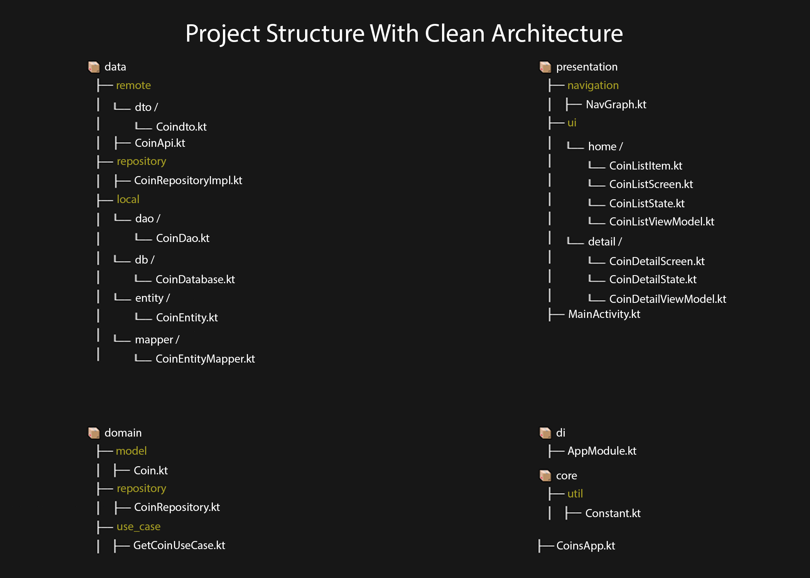
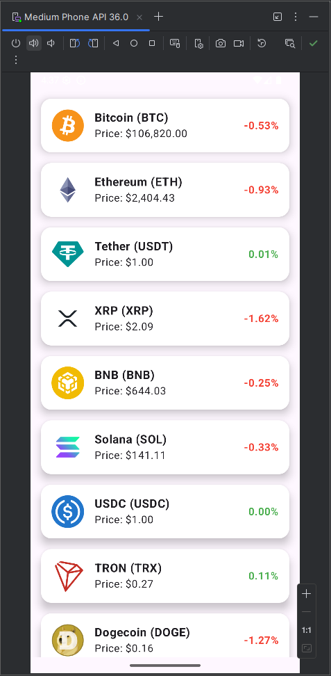

# 📱 CoinPrices

**CoinPrices** is a modern Android application that displays real‑time cryptocurrency prices. Built with **Clean Architecture**, **MVVM**, and **Jetpack Compose**, this project is a showcase of scalable, testable, and maintainable Android app development.


---

## 🧠 Key Features

- ✅ Real‑time cryptocurrency data using [CoinGecko API](https://www.coingecko.com/)
- 🛝 Navigation with Jetpack Compose
- 📄 Coin detail screen with price change
- 📂 Local caching with Room database
- 🔄 Swipe‑to‑refresh for updating prices
- 🌗 Modern UI with Material Design 3

---

## 🧱 Clean Architecture

This project follows the **Clean Architecture** principles by separating the codebase into `data`, `domain`, and `presentation` layers. This ensures **testability**, **scalability**, and **readability**.

### 📂 Project Structure



---

## 🛠️ Tech Stack

- **Kotlin**
- **Jetpack Compose** – UI Toolkit
- **Hilt** – Dependency Injection
- **Retrofit** – Networking
- **Room** – Local data persistence
- **Coroutines & Flow** – Asynchronous programming
- **MVVM** – Architecture pattern
- **Navigation Compose** – Screen transitions

---

## 🚀 Getting Started

```bash
git clone https://github.com/tyfnsk/CoinPrices.git
cd CoinPrices
./gradlew assembleDebug
```

Make sure you have Android Studio installed with latest SDK and Gradle version.

---

## 📚 Folder Overview

| Layer            | Description                                                          |
| ---------------- | -------------------------------------------------------------------- |
| **data**         | Contains remote & local data sources, DTOs, and mappers              |
| **domain**       | Business logic, use cases, repository interface, and models          |
| **presentation** | UI layer (Jetpack Compose), state management, ViewModels, navigation |
| **di**           | Hilt modules for dependency injection                                |
| **core**         | Constants and utility classes                                        |

---

## 📸 UI Preview



---

## 📄 License

This project is licensed under the MIT License – see the [LICENSE](LICENSE) file for details.

---

## 🙋‍♂️ Author

Developed by **Tayfun Işık**\
If you like the project, feel free to give it a ⭐ on GitHub!


